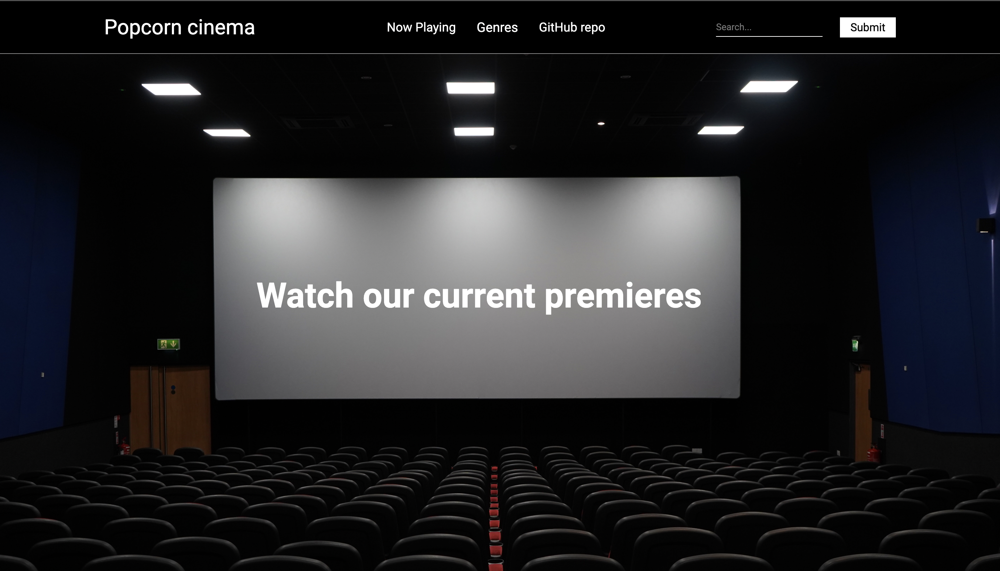

# Popcorn cinema

## Description/Overview

Popcorn cinema is a movie app made with React.  It fetches movies from The Movie Database using API calls and present them in functional website. You can view the top playing movies, sort them by genre, or search for other movies using the search in the navbar.

The idea of creating this project comes from this [repo](https://github.com/dangconnie/movie-app). I wanted to make a project using react so instead of using Bootstrap and jQuery as in the original repo, i decided to use React. This is my first project with React.

[GitHub repo](https://github.com/DILLIR/movie-site/tree/main)

## Jump right to the topic

[Description/Overview](#descriptionoverview)
[Technologies](#technologies)
[Challenges and solutions](#challenges-and-solutions)
[About site with screenshots](#about-site-with-screenshots)

## Technologies

All technologies I used are here.

**Main**
+ HTML
+ CSS
+ JavaScript
+ React

**Other**
+ git
+ react-router
+ node modules
+ create-react-app
+ Intersection Observer API
  
## Challenges and Solutions

1. **Challenge:** First of the challenges was to make Infinite Scroll and render new films properly using react. 

    **Solution:** I used intersection observer API, which tracks whether an object is in sight and performs a callback function which fetches new films. Also, it is needed to pass to function current page, but not set it before calling the function, because changing state is async function which doesn't affect atonce to the value. Also, I decomposed this solution in different parts.

    **using observer** 
    ```js
    const lastElement = useRef();

    useObserver(lastElement, page < totalPages,   isLoading, ()=>{
        setPage(p=>p+1);
    })
    ```
   
2. **Challenge:** To implement infinite scroll into search page and to properly show the page of result.

     **Solution:** First, I created new useEffect and added dependency search query, but it worked not well because when the query was changed, the page was still the same. I tried to change page state before fetching, but because changing state is async function which doesn't affect atonce to the value, fetching was with old value of page. So, I changed code a bit, and now I passed page and set it in callback function of fetching.

    **using useEffect** 
    ```js
    useEffect(() => {
        searchFilms(1);
    }, [params.query]);
    ```
## About site with screenshots

First what you see when you open a site is its main page where you can see current premiers, and you can scroll down to load more of them.




You can click on every poster and see a pop up with information about this film


Also, you can click on genres and select your favorite to view films from it.


And the last page is a search page. You can type your search query into input in navbar and click submit or press Enter to search. Then the search page is loaded with results.


If you have bad internet connection, you will need to wait for pictures to load and while they are loading, you are watching gray placeholders.


